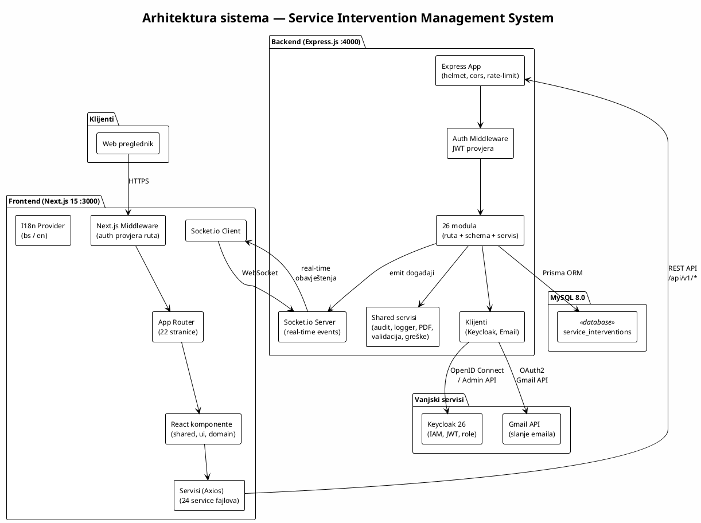

# Tehnički pregled sistema — Service Intervention Management System

> Dokument je namijenjen osobama koje prvi put prilaze projektu. Daje pregled arhitekture, ključnih komponenti, tehnologija i sigurnosnih odluka.

---

## 1. Kratak opis

Sistem za upravljanje servisnim intervencijama (Service Intervention Management System) omogućava prijavu kvarova, dodjelu intervencija serviserima, praćenje statusa, generisanje izvještaja i komunikaciju između korisnika, koordinatora i servisera. Podržava višekorisnički rad sa različitim ulogama i real-time obavještenjima.

---

## 2. Tehnologija

| Sloj | Tehnologija |
|---|---|
| Frontend | Next.js 15, React 19, TypeScript, Tailwind CSS 4, shadcn/ui, Axios, Socket.io Client |
| Backend | Express.js 4, TypeScript, Prisma ORM 6, Socket.io 4, Zod (validacija) |
| Baza podataka | MySQL 8.0 |
| Identitet (IAM) | Keycloak 26 |
| Email | Gmail API (OAuth2) |
| Kontejnerizacija | Docker, Docker Compose |

---

## 3. Dijagram arhitekture



---

## 4. Struktura projekta

```
projekat/
├── backend/                # Express.js backend
│   ├── prisma/
│   │   └── schema.prisma   # Definicija baze (20+ modela)
│   └── src/
│       ├── app.ts          # Kreiranje Express aplikacije
│       ├── server.ts       # Ulazna tačka servera
│       ├── clients/        # Keycloak i Email klijenti
│       ├── config/         # Env, database konfiguracija
│       ├── constants/      # HTTP statusi, rute, validacija
│       ├── controllers/    # Auth kontroler
│       ├── middleware/      # Auth, error, rate-limit, logger, validacija
│       ├── modules/        # 26 poslovnih modula (ruta + schema + logika)
│       ├── realtime/       # Socket.io server
│       ├── routes/         # Health ruta
│       ├── services/       # Auth, geocoding, recurring, reports servisi
│       ├── shared/         # Audit, logger, PDF, validacija, greške
│       └── scripts/        # Seed i utility skripte
├── frontend/               # Next.js 15 frontend
│   └── src/
│       ├── app/            # App Router (22 stranice)
│       ├── components/     # UI, shared i domain komponente
│       ├── constants/      # Rute, konstante
│       ├── lib/            # API, auth, i18n, socket, utils
│       ├── models/         # TypeScript tipovi (FaultReport, Company, Category)
│       ├── services/       # 24 Axios servisa za pozive backendu
│       └── types/          # Deklaracije tipova
├── shared/                 # Dijeljeni enumeracije (frontend + backend)
│   └── enums.ts
├── infra/                  # Infrastrukturni fajlovi
│   ├── keycloak/           # Keycloak realm konfiguracija
│   └── mysql/              # MySQL init skripte
├── docker-compose.yml      # Orkestracija kontejnera
└── Dockerfile              # Višefazni build (backend + frontend)
```

---

## 5. Backend — glavne komponente

### 5.1 Moduli (26)

Svaki modul sadrži barem jedan od sljedećih fajlova: `*.route.ts`, `*.schema.ts`, `*.service.ts`.

| Modul | Opis |
|---|---|
| `auth` | Registracija, prijava, odjava, reset lozinke |
| `users` | Upravljanje korisnicima |
| `companies` | Upravljanje kompanijama |
| `categories` | Kategorije intervencija |
| `fault-reports` | Prijave kvarova |
| `interventions` | Intervencije (glavni entitet) |
| `assignments` | Dodjela servisera intervencijama |
| `availability` | Dostupnost servisera |
| `reports` | Izvješta o intervencijama |
| `attachments` | Prilozi (fajlovi) |
| `notifications` | Obavještenja |
| `sla` | SLA konfiguracija (rokov po prioritetu) |
| `audit` | Audit log (praćenje promjena) |
| `comments` | Komentari na intervencije |
| `feedback` | Povratne informacije korisnika |
| `history` | Istorija statusa intervencija |
| `tickets` | Tiketi za podršku |
| `messages` | Poruke unutar tiketa |
| `profile` | Profil korisnika |
| `blocking` | Blokiranje korisnika |
| `system-config` | Sistemska konfiguracija |
| `user-preferences` | Korisničke preference |
| `maps` | Geokodiranje i mape |
| `management` | Menadžment funkcionalnosti |
| `escalations` | Eskalacije intervencija |
| `appointment-reschedule` | Pomijeranje termina |

### 5.2 Middleware

| Middleware | Fajl | Svrha |
|---|---|---|
| Auth | `src/middleware/auth.middleware.ts` | JWT validacija, učitavanje korisnika iz Keycloak tokena |
| Rate Limit | `src/middleware/rateLimit.middleware.ts` | Limit zahtjeva (200 / 15 min) |
| Error | `src/middleware/error.middleware.ts` | Centralno rukovanje greškama |
| Request Logger | `src/middleware/request-logger.middleware.ts` | Logovanje svih zahtjeva |
| Validate | `src/middleware/validate.middleware.ts` | Zod validacija request tijela |

### 5.3 Dijeljeni servisi (`src/shared/`)

| Fajl | Svrha |
|---|---|
| `audit.service.ts` | Logovanje akcija u AuditLog tabelu |
| `logger.ts` | Strukturirani logger |
| `pdf.service.ts` | Generisanje PDF izvještaja |
| `validation.ts` | Zod šeme za sigurno tekstualno polje (anti-XSS) |
| `errors.ts` | Custom error klase |
| `async-handler.ts` | Wrapper za async rute |

---

## 6. Frontend — glavne komponente

### 6.1 Stranice (App Router)

| Ruta | Opis |
|---|---|
| `/` | Početna stranica |
| `/login`, `/register` | Autentikacija |
| `/reset-password` | Reset lozinke |
| `/dashboard` | Kontrolna tabla |
| `/interventions` | Lista intervencija |
| `/interventions/new` | Nova intervencija |
| `/interventions/[id]` | Detalj intervencije |
| `/fault-reports` | Prijave kvarova |
| `/tickets` | Tiketi podrške |
| `/assignments` | Dodjele servisera |
| `/reports` | Izvještaji |
| `/history` | Istorija |
| `/map` | Prikaz na mapi |
| `/profile` | Korisnički profil |
| `/settings` | Postavke |
| `/company` | Kompanija (CompanyAdmin) |
| `/admin` | Admin panel |
| `/admin/companies` | Upravljanje kompanijama |
| `/admin/categories` | Upravljanje kategorijama |
| `/admin/sla-config` | SLA konfiguracija |
| `/blocked-users` | Blokirani korisnici |
| `/management` | Menadžment |

### 6.2 Komponente (`src/components/`)

| Direktorij | Sadržaj |
|---|---|
| `ui/` | Osnovne UI komponente (shadcn/ui): Button, Card, Dialog, Input, Table, Badge... |
| `shared/` | Zajedničke komponente: AppNavigation, DataTable, FilterBar, PageLayout, StatCard, MonthCalendar, CommentsSection, ConfirmDialog... |
| `assignments/` | AssignerModal, AssignedServicersSection |
| `companies/` | CompanyFormFields |
| `fault-reports/` | DuplicateWarningDialog |
| `feedback/` | FeedbackSection |
| `interventions/` | BulkActionToolbar, EscalationSection, KnowledgeBaseSection |
| `reports/` | ReportSection, MaterialItemList |

### 6.3 Servisi (`src/services/`)

24 Axios servisa koji pozivaju backend REST API. Svaki servis odgovara jednom backend modulu. Ključni servisi:

- `auth.service.ts` — prijava, registracija, odjava
- `interventions.service.ts` — CRUD intervencija
- `tickets.service.ts` — CRUD tiketa
- `notifications.service.ts` — obavještenja
- `dashboard.service.ts` — podaci za kontrolnu tablu

### 6.4 Autentikacija na frontendu

- `src/lib/api.ts` — Axios instanca sa interceptorima (dodavanje JWT tokena, rukovanje 401/403)
- `src/lib/auth.ts` — Dekodiranje JWT tokena, provjera uloga
- `middleware.ts` — Next.js middleware za zaštitu ruta na serveru (pročitava `token` cookie)

---

## 7. Baza podataka

### 7.1 ORM

Prisma ORM sa MySQL provajderom. Schema je definisana u `backend/prisma/schema.prisma`.

### 7.2 Modeli (20+)

| Model | Opis |
|---|---|
| `User` | Korisnici sistema |
| `Company` | Kompanije (servisne firme) |
| `ExternalIdentity` | Veza korisnika sa Keycloak identitetom |
| `PasswordResetToken` | Tokeni za reset lozinke |
| `UserPreference` | Jezik, notifikacijske preference |
| `Category` | Kategorije intervencija/kvarova |
| `FaultReport` | Prijave kvarova od strane korisnika |
| `Intervention` | Glavni entitet — intervencije |
| `Assignment` | Dodjela servisera intervenciji |
| `Report` | Izvješta o izvršenoj intervenciji |
| `Attachment` | Prilozi (fajlovi) |
| `InterventionComment` | Komentari na intervencije |
| `StatusHistory` | Istorija promjena statusa |
| `Feedback` | Ocjene i komentari korisnika |
| `ExecutionConfirmation` | Potvrda izvršenja (PIN / potpis) |
| `InterventionPause` | Pauziranje intervencije |
| `InterventionEscalation` | Eskalacije |
| `InterventionReopenRequest` | Zahtjevi za ponovno otvaranje |
| `AppointmentRescheduleRequest` | Zahtjevi za pomijeranje termina |
| `ServicerUnavailability` | Nedostupnost servisera |
| `Ticket` | Tiketi podrške |
| `TicketCategory` | Kategorije tiketa |
| `Message` | Poruke unutar tiketa |
| `Notification` | Obavještenja korisnicima |
| `AuditLog` | Audit log (praćenje svih akcija) |
| `SystemConfig` | Sistemska konfiguracija (key-value) |
| `SlaConfiguration` | SLA rokovi po prioritetu |
| `UserBlock` | Blokiranje korisnika po kompaniji |

### 7.3 Ključne enumeracije

- `Priority`: LOW, MEDIUM, HIGH, CRITICAL
- `InterventionStatus`: NEW, ASSIGNED, IN_PROGRESS, ON_HOLD, RESOLVED, CANCELLED, REJECTED
- `TicketStatus`: OPEN, IN_PROGRESS, RESOLVED, CLOSED
- `CompanyStatus`: PENDING, ACTIVE, REJECTED, INACTIVE
- `NotificationType`: 19 tipova obavještenja

---

## 8. Vanjski servisi

### 8.1 Keycloak (Identitet i pristup)

- **Verzija**: 26.6.1
- **Uloga**: Centralni sistem za autentikaciju i autorizaciju (IAM)
- **Protokol**: OpenID Connect (OIDC)
- **Konfiguracija**: `infra/keycloak/realm-template.json`
- **Klijent**: `backend/src/clients/keycloak.client.ts`

**Kako radi:**
1. Korisnik se prijavljuje preko backend endpointa (`/api/v1/auth/login`)
2. Backend poziva Keycloak token endpoint sa korisničkim kredencijalima
3. Keycloak vraća JWT access_token i refresh_token
4. Frontend čuva token u `localStorage` i šalje ga kao `Authorization: Bearer` header
5. Backend middleware dekodira JWT, provjerava isteklo vrijeme i učitava uloge
6. Za autorizaciju, backend može dohvatiti svježe uloge direktno iz Keycloak Admin API-ja

**Uloge u sistemu:**
- `Korisnik` — obični korisnik (prijavljuje kvarove)
- `Serviser` — serviser (izvršava intervencije)
- `Koordinator` — koordinator (dodjeljuje intervencije)
- `Menadzment` — menadžment (pregled izvještaja)
- `KompanijaAdmin` — administrator kompanije
- `SupportAgent` — agent podrške (tiketi)
- `Admin` — sistemski administrator

### 8.2 Gmail API (Email)

- **Klijent**: `backend/src/clients/email.client.ts`
- **Svrha**: Slanje emailova za reset lozinke
- **Autentikacija**: OAuth2 (client_id, client_secret, refresh_token)
- **Fallback**: U development modu, link za reset se ispisuje u konzolu ako Gmail nije konfigurisan

### 8.3 Socket.io (Real-time)

- **Server**: `backend/src/realtime/socket.ts`
- **Klijent**: `frontend/src/lib/socket.ts`
- **Svrha**: Real-time obavještenja i praćenje prisustva na tiketima
- **Događaji**: `user:join`, `role:join`, `ticket:join`, `ticket:leave`, `system:connected`

---

## 9. Kako komponente komuniciraju

### 9.1 Frontend → Backend (REST API)

```
Frontend (Axios)  ──HTTP──►  Backend (Express)
   /api/v1/*                    ├── Auth Middleware (JWT)
                                ├── Route Handler
                                ├── Zod Validation
                                ├── Service Layer
                                └── Prisma → MySQL
```

- Svi API pozivi idu na `/api/v1/*`
- Axios interceptor dodaje JWT token iz `localStorage`
- 401 odgovor automatski preusmjerava na login
- 403 odgovor preusmjerava na dashboard/company stranicu

### 9.2 Backend → Keycloak

```
Backend (keycloak.client.ts)  ──HTTPS──►  Keycloak Server
   ├── POST /realms/{realm}/protocol/openid-connect/token     (login)
   ├── POST /realms/{realm}/protocol/openid-connect/logout    (logout)
   ├── GET  /admin/realms/{realm}/users                       (traženje korisnika)
   ├── POST /admin/realms/{realm}/users                       (kreiranje korisnika)
   └── GET  /admin/realms/{realm}/users/{id}/role-mappings    (čitanje uloga)
```

### 9.3 Backend → MySQL

```
Backend (Prisma Client)  ──TCP:3306──►  MySQL 8.0
   ├── prisma.user.findMany()
   ├── prisma.intervention.create()
   └── ... (20+ modela)
```

### 9.4 Real-time (WebSocket)

```
Backend (Socket.io Server)  ◄──WS──►  Frontend (Socket.io Client)
   ├── emitToUser(userId, event, data)    → user:{id} soba
   ├── emitToRole(role, event, data)      → role:{name} soba
   └── ticket presence tracking           → ticket:{id} soba
```

---

## 10. Sigurnosne odluke

### 10.1 Autentikacija i autorizacija

| Odluka | Implementacija |
|---|---|
| Centralizovani identitet | Keycloak (OpenID Connect) — korisnički kredencijali se ne čuvaju lokalno |
| JWT validacija | Backend dekodira JWT, provjerava `exp` i `nbf` polja |
| Svježe uloge | Za kritične akcije, backend poziva Keycloak Admin API da dobije trenutne uloge (ne oslanja se samo na token) |
| RBAC (Role-Based Access Control) | `authorizeRoles()` middleware provjerava uloge na ruti |
| Frontend zaštita ruta | Next.js middleware čita `token` cookie i provjerava uloge prije renderovanja |
| Deaktivirani korisnici | Provjera `active` polja u bazi pri svakom autentikacijskom zahtjevu |

### 10.2 Zaštita na transportnom nivou

| Odluka | Implementacija |
|---|---|
| CORS | Dozvoljene samo specificirane origin-e (`CORS_ORIGIN` env varijabla) |
| Helmet | `helmet()` middleware — sigurnosni HTTP headeri |
| Rate limiting | 200 zahtjeva po IP-u u 15 minuta (`express-rate-limit`) |
| Cache-Control | `no-store` na svim autentifikovanim odgovorima |

### 10.3 Validacija i sanitizacija

| Odluka | Implementacija |
|---|---|
| Zod validacija | Svi request body-i se validiraju kroz Zod šeme |
| Anti-XSS | `safeTextField()` funkcija odbija HTML tagove u tekstualnim poljima |
| Regex za imena | `personNameField()` dozvoljava samo slova, razmake, apostrofe i crtice |
| Limit tijela | `express.json({ limit: '15mb' })` — ograničenje veličine requesta |

### 10.4 Sigurnost lozinki

| Odluka | Implementacija |
|---|---|
| Hashing | Lozinke se hash-uju unutar Keycloak-a (bcrypt) |
| Reset lozinke | Jednokratni token sa rokom trajanja, poslat putem emaila |
| Password policy | Keycloak konfiguracija (minimalna dužina, kompleksnost) |

### 10.5 Audit i logovanje

| Odluka | Implementacija |
|---|---|
| Audit log | `AuditLog` tabela bilježi sve akcije (ko, šta, kada, stare/nove vrijednosti) |
| Strukturirani logovi | `logger.ts` servis za konzistentno logovanje |
| Request logging | `request-logger.middleware.ts` loguje sve HTTP zahtjeve |

### 10.6 Sigurnost priloga

| Odluka | Implementacija |
|---|---|
| Tip fajla | Validacija MIME tipa prilikom uploada |
| Veličina | Ograničenje veličine fajla |
| Pohrana | Prilozi se pohranjuju sa jedinstvenim ključem (`storageKey`) |

---

## 11. Pokretanje sistema

### 11.1 Docker Compose (preporučeno)

```bash
cd projekat
docker-compose up --build
```

Pokreće 4 servisa:
- **mysql** — MySQL 8.0 na portu 3307
- **keycloak** — Keycloak na portu 8080
- **backend** — Express.js na portu 4000
- **frontend** — Next.js na portu 3000

### 11.2 Razvojno okruženje

```bash
# Backend
cd projekat/backend
npm install
npx prisma generate
npx prisma migrate dev
npm run dev

# Frontend (novi terminal)
cd projekat/frontend
npm install
npm run dev
```

---

## 12. Ključne datoteke — brzi referentni vodič

| Šta tražite | Gdje pogledati |
|---|---|
| Ulazna tačka backend-a | `backend/src/server.ts` |
| Express konfiguracija i rute | `backend/src/app.ts` |
| Schema baze podataka | `backend/prisma/schema.prisma` |
| Autentikacija (middleware) | `backend/src/middleware/auth.middleware.ts` |
| Keycloak integracija | `backend/src/clients/keycloak.client.ts` |
| Email integracija | `backend/src/clients/email.client.ts` |
| Socket.io server | `backend/src/realtime/socket.ts` |
| Env konfiguracija | `backend/src/config/env.ts` |
| API rute i konstante | `backend/src/constants/index.ts` |
| Validacija (Zod) | `backend/src/shared/validation.ts` |
| PDF generisanje | `backend/src/shared/pdf.service.ts` |
| Audit log | `backend/src/shared/audit.service.ts` |
| Frontend layout | `frontend/src/app/layout.tsx` |
| Axios klijent | `frontend/src/lib/api.ts` |
| Frontend auth util | `frontend/src/lib/auth.ts` |
| Next.js middleware | `frontend/middleware.ts` |
| Socket.io klijent | `frontend/src/lib/socket.ts` |
| I18n (bosanski/engleski) | `frontend/src/lib/i18n.tsx` |
| Dijeljene enumeracije | `shared/enums.ts` |
| Docker Compose | `docker-compose.yml` |
| Keycloak realm | `infra/keycloak/realm-template.json` |
