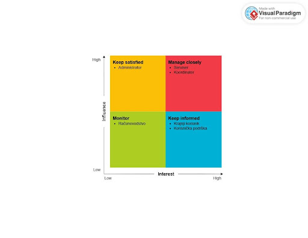

# Stakeholder Map

---

## Tabela stakeholdera

| Stakeholder | Uloga u sistemu | Interes | Očekivanja | Uticaj na zahtjeve | Važnost komunikacije | Važnost MVP |
|---|---|---|---|---|---|---|
| Krajnji korisnik | Prijavljuje kvar | Jednostavna prijava kvara | Pregledan i lak za snalaženje interfejs | Srednji | Visoka | Visoka |
| Serviser | Primaju intervencije, pisanje izvještaja po završetku intervencije | Pregledan raspored i laka evidencija rada | Detaljne informacije o kvaru | Visok | Visoka | Visoka |
| Administrator | Upravlja i održava sistem i brine se za sigurnost | Sigurnost podataka i kontrola nad sistemom | Upravljanje korisničkim računima, backup podataka | Visok | Niska | Vrlo visoka |
| Korisnička podrška | Pomaže korisnicima i odgovara na njihove zahtjeve | Efikasno rješavanje problema i kvalitetna podrška | Jednostavna komunikacija sa korisnicima i uvid u historiju komunikacije | Nizak | Vrlo visoka | Srednja |
| Koordinator | Nadgleda i dodjeljuje zadatke serviserima | Efikasno raspoređivanje zadataka | Pregled svih prijava, raspored servisera, dodjela zadataka, praćenje statusa intervencija | Visok | Visoka | Visoka |
| Računovodstvo | Upravlja finansijama | Tačna evidencija troškova i prihoda | Pristup izvještajima, kreiranje faktura, uvid u troškove intervencija | Srednji | Niska | Niska |

---

## Stakeholder matrica

