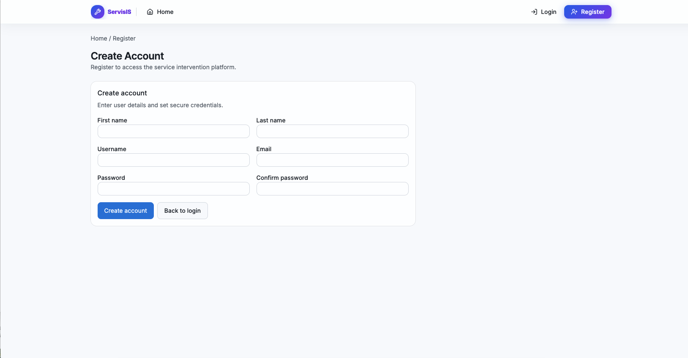
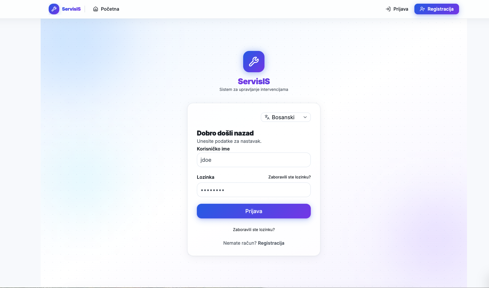
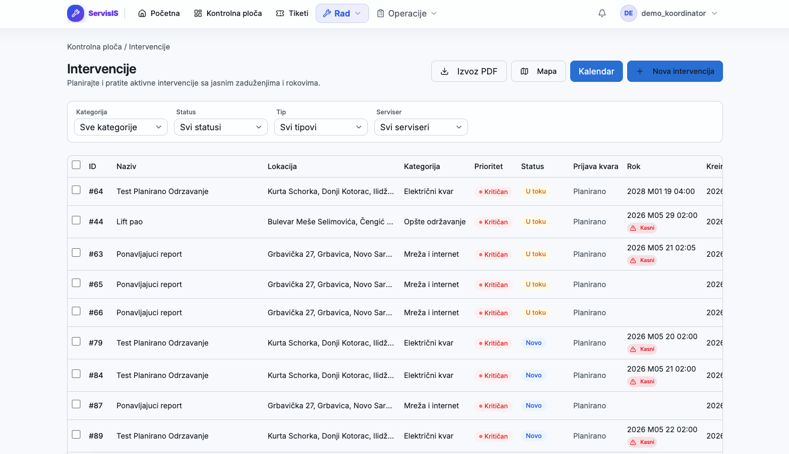
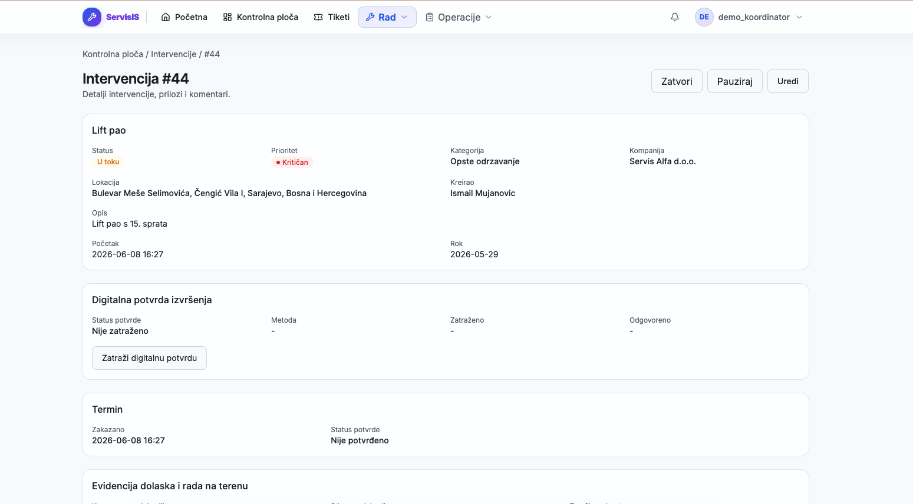
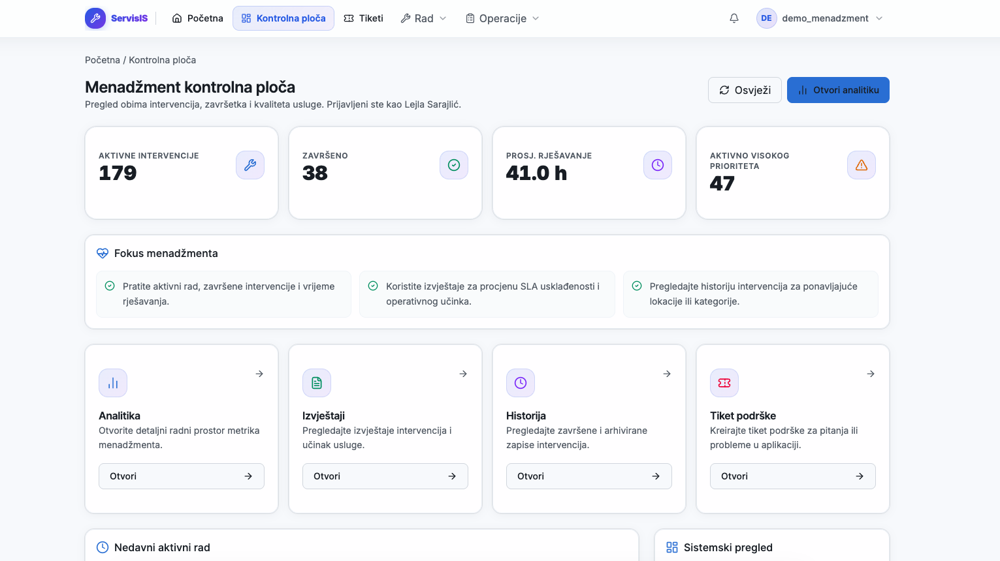
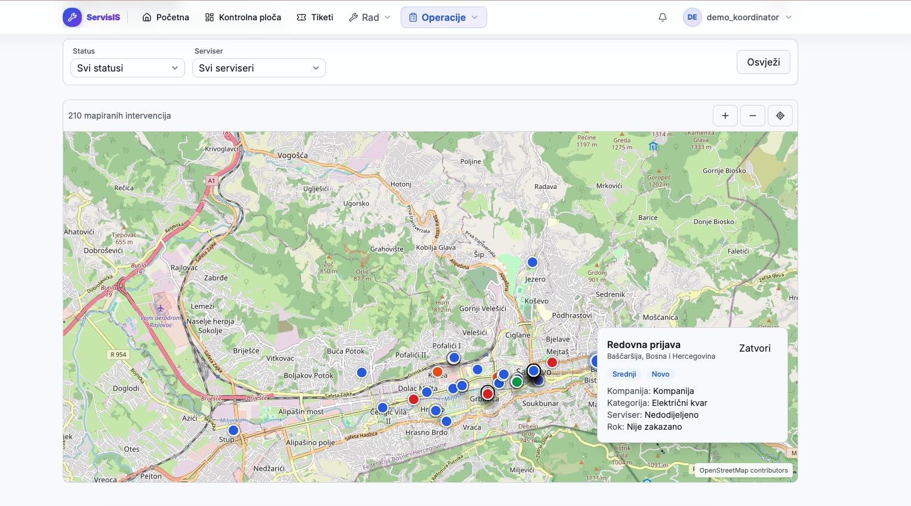
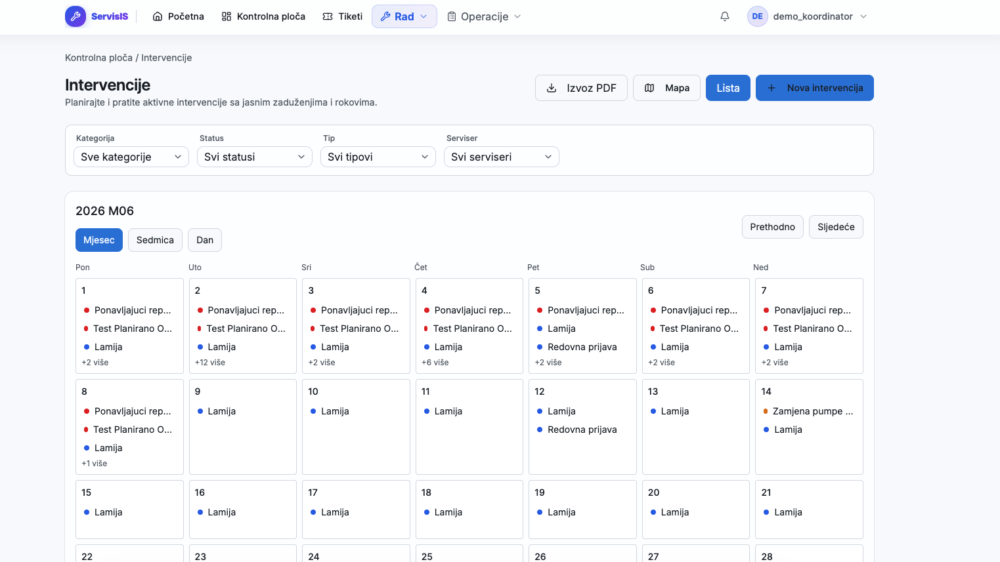
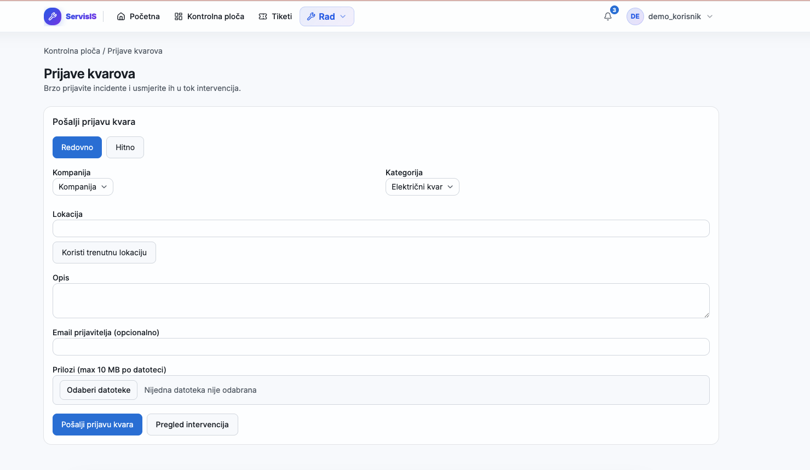
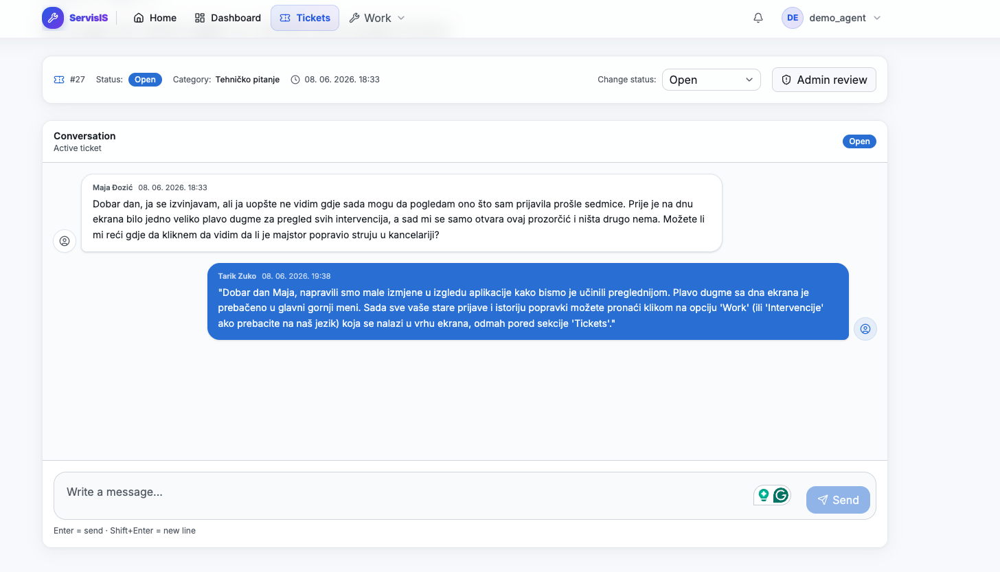

# Korisnički priručnik
## Sistem za upravljanje servisnim intervencijama | v1.0

---

## Sadržaj

1. [Uvod](#1-uvod)
2. [Korisničke uloge](#2-korisničke-uloge)
3. [Pristup sistemu](#3-pristup-sistemu)
4. [Pregled glavnih ekrana](#4-pregled-glavnih-ekrana)
5. [Korak-po-korak upute za ključne korisničke tokove](#5-korak-po-korak-upute-za-ključne-korisničke-tokove)
6. [Ograničenja sistema](#6-ograničenja-sistema)

---

## 1. Uvod

### 1.1 Svrha dokumenta

Ovaj priručnik namijenjen je krajnjim korisnicima Sistema za upravljanje servisnim intervencijama. Dokument pruža jasan i konkretan vodič kroz sve ključne funkcionalnosti sistema -od početne prijave do naprednijeg upravljanja intervencijama- bez pretpostavke o prethodnom tehničkom znanju korisnika.

Priručnik ne opisuje arhitekturu sistema niti detalje implementacije. Fokus je isključivo na tome šta korisnik može raditi, kako to može uraditi i šta može očekivati kao rezultat svake akcije.

### 1.2 Kome je sistem namijenjen

Sistem je namijenjen organizacijama koje upravljaju servisnim timovima na terenu kao što su komunalna preduzeća, servisne kompanije, upravljači zgrada i slične institucije. Svakodnevno ga koriste sedam tipova korisnika: administrator, administrator firme, koordinator, serviser, menadžment, agent podrške i korisnik.

---

## 2. Korisničke uloge

Sistem razlikuje sedam korisničkih uloga, a svaka od njih ima tačno definisan skup dozvola. Uloga se dodjeljuje pri kreiranju računa i može je promijeniti isključivo administrator.

### 2.1 Administrator

Administrator ima najširi pristup sistemu. Odgovoran je za inicijalno postavljanje sistema i upravljanje organizacijskim postavkama. Konkretno, administrator:

- Kreira, uređuje, aktivira i deaktivira korisničke račune (ne može deaktivirati vlastiti račun)
- Dodjeljuje uloge korisnicima i vezuje ih za firmu (ukoliko je to potrebno)
- Konfigurira SLA rokove po nivoima prioriteta
- Definira dozvoljene tipove fajlova i maksimalnu veličinu za upload
- Upravlja kategorijama kvarova
- Briše neodgovarajuće attachmente (brisanje attachmenata je isključivo administrativna akcija)
- Može blokirati/deblokirati korisnike u kontekstu tiketa (blokiranje je po tiketu i ne deaktivira račun)
- Ima pristup audit logu koji bilježi sve kritične izmjene

### 2.2 Administrator firme (Kompanija Admin)

Administrator firme upravlja korisnicima i postavkama unutar jedne konkretne firme. Ova uloga mora biti vezana za firmu u sistemu jer dodjela bez firme nije moguća. Administrator firme:

- Ima pristup postavkama vezanim za firmu

### 2.3 Koordinator

Koordinator je centralna operativna figura sistema. Planira intervencije, raspoređuje servisere i prati cjelokupno stanje na terenu. Koordinator:

- Kreira i zakazuje intervencije (na osnovu prijave kvara ili samostalno)
- Dodjeljuje prioritet svakoj intervenciji i mijenja ga po potrebi
- Raspoređuje servisere i izmjenjuje dodjele
- Prati listu aktivnih intervencija, filtrira i sortira po različitim kriterijima
- Mijenja statuse intervencija (ovisno o dozvoljenim prijelazima)
- Dodaje komentare i pregledava attachmente
- Vrši masovne akcije nad više intervencija odjednom
- Eksportuje listu intervencija u PDF format
- Pregledava feedback korisnika vezan za konkretnu intervenciju
- Prima in-app notifikacije pri radu na intervenciji

> **Napomena:** Koordinator može pregledavati i preuzimati attachmente, ali brisanje attachmenata je rezervisano za administratore.

### 2.4 Serviser

Serviser je terenski radnik koji izvršava intervencije i izvještava o radu. Serviser mora biti vezan za firmu u sistemu jer kreiranje korisnika s ulogom Serviser bez firme nije dopušteno. Serviser:

- Pregledava listu intervencija koje su mu dodijeljene
- Ažurira status intervencija dok radi na terenu
- Dodaje komentare uz kašnjenja ili komplikacije
- Pregledava historiju prethodnih intervencija na lokaciji
- Podnosi izvještaj o obavljenom radu po završetku intervencije
- Prima in-app notifikacije pri dodjeli novog zadatka

### 2.5 Menadžment

Menadžment ima pregled bez mogućnosti izmjene operativnih podataka. Ova uloga namijenjena je rukovodećim osobama koje trebaju ažurnu sliku stanja. Menadžment:

- Pregledava sve aktivne intervencije (samo čitanje, bez mogućnosti izmjene)
- Ima pristup menadžment dashboardu s ključnim pokazateljima u numeričkom i tabelarnom obliku
- Može eksportovati listu intervencija u PDF
- Ima uvid u pregled korištenja materijala odvojenih po vremenu, firmi i kategoriji

> **Napomena:** Grafički prikazi (chartovi, vizualizacije) nisu implementirani u MVP verziji -svi podaci su u numeričkom i tabelarnom obliku.

### 2.6 Agent podrške (Support Agent)

Agent podrške odgovara na tikete korisničke podrške. Agent podrške:

- Pregledava otvorene tikete korisnika
- Odgovara na poruke korisnika u okviru tiketa
- Zatvara tikete nakon što je problem riješen

### 2.7 Korisnik

Korisnik je vanjski korisnik koji prijavljuje kvarove putem sistema. Ovoj ulozi se automatski dodjeljuje svako ko se samoregistrira. Korisnik:

- Podnosi prijave kvarova putem namjenskog obrasca
- Prati status vlastitih prijava i tiketa
- Prima in-app obavijest o završetku intervencije
- Ocjenjuje kvalitet usluge (feedback) po završetku; moguće jednom po intervenciji
- Kreira tikete za korisničku podršku i komunicira s agentima podrške

---

## 3. Pristup sistemu

Aplikacija je dostupna na adresi: **https://sigrupa7.pages.dev**

### 3.1 Registracija novog korisnika

Vanjski korisnici koji žele prijaviti kvar mogu se registrovati samostalno. Zaposleni (koordinatori, serviseri, menadžment, agenti podrške i administratori firmi) dobijaju pristup isključivo putem administratora koji kreira njihove račune.

**Koraci za samoregistraciju:**

1. Otvoriti aplikaciju u web pretraživaču.
2. Na stranici za prijavu kliknuti na **„Registracija"** u gornjem desnom uglu ili na link **„Nemate račun? Registracija"**.
3. Unijeti tražene podatke: ime i prezime, email adresu, korisničko ime i lozinku.
4. Potvrditi registraciju klikom na **„Kreiraj račun"**.
5. Nakon uspješne registracije, sistem automatski dodjeljuje ulogu **Korisnik** i preusmjerava na početnu stranicu gdje se potrebno prijaviti.

> **Napomena:** Samoregistracija daje ulogu Korisnik i ne daje pristup internim ekranima za koordinatore, servisere i ostale zaposlene. Sve zaposleničke račune kreira administrator.

---

### 3.2 Prijava u sistem

**Koraci:**

1. Otvoriti aplikaciju u web pretraživaču.
2. Na stranici za prijavu kliknuti na **„Prijava"**
3. U polje **Korisničko ime** unijeti dodijeljeno korisničko ime.
4. U polje **Lozinka** unijeti lozinku.
5. Kliknuti na **„Prijava"** ili pritisnuti Enter.

**Očekivani rezultat:** Sistem provjerava podatke i preusmjerava korisnika na početnu stranicu koja odgovara njegovoj ulozi. U slučaju pogrešnih podataka, prikazuje se poruka o grešci bez otkrivanja razloga.

---

### 3.3 Demo kredencijali

Za svrhe testiranja i demonstracije sistema dostupni su sljedeći testni računi:

| Uloga | Korisničko ime | Lozinka |
|---|---|---|
| Administrator | `demo_admin` | `Administrator1` |
| Administrator firme | `demo_firma_admin` | `Adminfirme1` |
| Koordinator | `demo_koordinator` | `Koordinator1` |
| Serviser | `demo_serviser` | `Serviser1` |
| Menadžment | `demo_menadzment` | `Menadzment1` |
| Agent podrške | `demo_agent` | `Agentpodrske1` |
| Korisnik | `demo_korisnik` | `Korisnik1` |

---

### 3.4 Reset lozinke

**Koraci:**

1. Na stranici za prijavu kliknuti na **„Zaboravili ste lozinku?"**.
2. Unijeti email adresu vezanu za korisnički račun.
3. Kliknuti na **„Pošalji link za reset"**.
4. Provjeriti inbox (i spam folder) i kliknuti na link u primljenom emailu. Link vrijedi **30 minuta**.
5. Unijeti novu lozinku i potvrditi promjenu.

**Očekivani rezultat:** Nakon unosa nove lozinke sistem potvrđuje promjenu i preusmjerava na stranicu za prijavu. Sve aktivne sesije korisnika se automatski prekidaju.

---

## 4. Pregled glavnih ekrana

### 4.1 Lista aktivnih intervencija

Centralni operativni ekran za koordinatore i administratore. Prikazuje sve aktivne intervencije koje imaju status **Otvoreno** i **U procesu**. Lista je sortirana po prioritetu (Hitan > Visok > Normalan > Nizak), a unutar istog prioriteta po datumu kreiranja (starije intervencije prve).

1. Prijaviti se kao koordinator.
2. U gornjem meniju kliknuti na **„Rad"**
3. Iz padajuće liste odabrati **„Intervencije"**

**Informacije vidljive u svakom redu liste:**

- Naziv intervencije
- Lokacija
- Kategorija
- Prioritet
- Trenutni status
- Vrsta intervencije
- Rok za završetak
- Datum kreiranja
- Owner — autor/kreator intervencije 
- Dodijeljeni serviser(i)

Koordinator može koristiti filtere po kategoriji, statusu, tipu intervencije i dodijeljenom serviseru, te ih kombinovati. Klikom na checkbox pored intervencija moguće je označiti više njih i izvršiti masovne akcije (promjena statusa, dodjela servisera, arhiviranje).

> Menadžment vidi isti ekran bez mogućnosti izmjene. Serviser vidi samo intervencije kojima je dodijeljen. Korisnik vidi isključivo intervencije koje je sam kreirao.

---

### 4.2 Detalji intervencije

Klikom na bilo koju intervenciju u listi otvara se njen detaljan prikaz, organiziran u nekoliko sekcija:

- **Osnovni podaci** — naziv, opis, lokacija, vremenski okvir, status, prioritet
- **Digital execution confirmation** — potvrda izvršenja digitalno putem PIN-a ili potpisa; statusi su PENDING, CONFIRMED, REJECTED
- **Appointment** — informacije o zakazanom terminu s mogućnošću predlaganja reschedule zahtjeva
- **Field time tracking** — evidencija vremena provedenog na terenu
- **Dodjela servisera** — lista dodijeljenih servisera s mogućnošću izmjene
- **Knowledge base / prethodna rješenja** — zapis ranijih rješenja i relevantnih informacija
- **SLA indikator** — vizualni indikator koji pokazuje je li intervencija u kašnjenju u odnosu na definisani SLA rok
- **Report intervencije** — povezani izvještaji i evidencija materijala
- **Attachmenti** — lista priloženih fajlova s opcijama pregleda i preuzimanja
- **Eskalacije** — pregled eskalacija ako postoje
- **Komentari** — kronološki prikaz svih komentara koordinatora i servisera

---

### 4.3 Menadžment dashboard

Menadžment dashboard pruža numerički pregled ključnih pokazatelja rada servisnog tima: broj aktivnih i završenih intervencija, prosječno vrijeme rješavanja i distribuciju intervencija po prioritetima.
 
**Navigacija do ekrana:**
 
1. Prijaviti se kao menadžment.
2. U gornjem meniju kliknuti na **„Analitika"**.
3. Dashboard prikazuje opći pregled. Za pregled potrošnje materijala odabrati sekciju **„Potrošnja materijala"** unutar iste stranice.

> **Napomena:** Grafički prikazi (chartovi, vizualizacije trendova) nisu dio MVP verzije -svi podaci su u tabelarnom ili numeričkom obliku.
 

---

### 4.4 Historija intervencija

Historija sadrži sve završene i arhivirane intervencije. Koordinatori i serviseri mogu pretražiti historiju prema lokaciji ili uređaju, što je korisno pri provjeri je li isti kvar ranije prijavljen i kako je riješen.

Svaka stavka prikazuje: datum, status, sažetak opisa, ime servisera i prioritet. Klikom na intervenciju otvaraju se njeni puni detalji.

> Moguće je izvršiti masovnu akciju arhiviranja ili dearhiviranja nad više stavki historije odjednom (koordinator i administrator). Menadžment ima samo pristup pregledu, ne i arhiviranju.

---

### 4.5 Mapski prikaz intervencija

Koordinator može prebaciti prikaz sa liste na interaktivnu mapu klikom na odgovarajuće dugme. Na mapi su sve intervencije s poznatom lokacijom prikazane kao markeri. Klikom na marker prikazuju se osnovne informacije o intervenciji. Mapski prikaz podržava iste filtere kao i listni prikaz.
 
> Mapski prikaz dostupan je samo koordinatoru i administratoru.
 

---

### 4.6 Kalendarski prikaz

Koordinator može pregledati intervencije i u kalendarskom prikazu, koji pruža vremensku perspektivu planiranja. Ovo je posebno korisno pri upravljanju periodičnim i preventivnim održavanjima.
 

---

### 4.7 Tiketi za korisničku podršku

Svaki prijavljeni korisnik može kreirati tiket za korisničku podršku. Korisnik vidi isključivo vlastite tikete. U okviru otvorenog tiketa moguće je razmjenjivati poruke s agentom podrške.

Agent podrške i korisnik dobivaju in-app notifikaciju o kreiranom ili odgovorenom tiketu. Administrator može blokirati korisniku slanje poruka u konkretnom tiketu. Nakon zatvaranja tiketa, daljnja komunikacija nije moguća.

---

### 4.8 Settings stranica

Settings stranica dostupna je svim prijavljenim korisnicima i prikazuje isključivo postavke relevantne za konkretnu ulogu. 

**Navigacija do ekrana**:

1. Pristupa se klikom na ikonu profila.
2. Iz opadajućeg menija odabere se opcija **"Postavke"**

 Svaki korisnik može promijeniti jezik prikaza i upravljati preferencijama notifikacija. Administrator dodatno vidi sekcije: SLA konfiguracija, pravila za attachmente, upravljanje kategorijama, korisnicima i firmama.
 

---

## 5. Korak-po-korak upute za ključne korisničke tokove

### 5.1 Prijava kvara

**Ko može ovo uraditi:** Svi prijavljeni korisnici

**Koraci:**

1. Na početnoj stranici kliknuti na **„Prijavi kvar"**.
2. U obrascu za prijavu unijeti:
   - Odabrati firmu iz padajuće liste 
   - Odabrati kategoriju kvara 
   - Unijeti ili pustiti sistem da detektuje lokaciju 
   - Unijeti opis problema - jasno i sažeto (šta se dogodilo, kada, tačna lokacija, broj uređaja)
   - Opciono: priložiti slike ili dokumente klikom na „Dodaj fajl" (preporučuje se barem jedna fotografija)
3. Kliknuti na **„Pošalji prijavu kvara"**.

**Očekivani rezultat:** Sistem sprema prijavu i prikazuje potvrdu s jedinstvenim identifikatorom. Ako je sistem detektovao potencijalnu duplikatu prijave na istoj lokaciji, prikazuje se upozorenje; korisnik može nastaviti ili se vratiti na prethodni ekran.

> **Napomena:** Upozorenje na duplikat je najpouzdanije kada su dostupne GPS koordinate. Ako korisnik unese samo tekstualnu adresu, ista lokacija se ne mora uvijek prepoznati kao duplikat.
 

---

### 5.2 Kreiranje intervencije

**Ko može ovo uraditi:** Koordinator

Intervencija se može kreirati na osnovu postojeće prijave kvara ili samostalno (za planirana i preventivna održavanja).

**Koraci:**

1. Navigirati na ekran aktivnih intervencija i kliknuti na **„Nova intervencija"** ili na pocetnom dashboardu pritisnuti na “nova intervencija“.
2. Popuniti obavezna polja:
   - **Naziv** — kratak, jasan naslov
   - **Opis** — detaljan opis problema i napomene
   - **Lokacija** — adresa ili odabir iz predložene liste
   - **Kategorija**
   - **Kompanija**
   - **Prioritet** — Kritičan/Srednji/Visok/Nizak
   - **Tip intervencije**
   - **Datum početka** i **rok završetka** — klikom na polje kalendara odabrati datume
   - **Ponavljanje** - Bez ponavljanja / Dnevno / Sedmično / mjesečno
3. Opciono: vezati intervenciju za postojeću prijavu kvara klikom na „Poveži s prijavom", pretraživanjem i odabirom odgovarajuće prijave.
4. Kliknuti na **„Kreiraj intervenciju"**.

**Očekivani rezultat:** Intervencija se odmah pojavljuje u listi aktivnih intervencija s ispravnim statusom **Novo**.

> **Napomena:** Ako neki od obaveznih podataka nije unesen, sistem neće dozvoliti čuvanje i označit će problematična polja porukom o grešci (npr. „Name must contain at least 3 characters").
> **Poznato ograničenje:** Dnevno i sedmično ponavljanje rade očekivano, ali mjesečno ponavljanje ima poznat problem pri datumima na kraju mjeseca i buduće instance nisu uvijek vidljive unaprijed u kalendaru.

---

### 5.3 Dodjela servisera intervenciji

**Ko može ovo uraditi:** Koordinator

**Koraci:**

1. Otvoriti detalje intervencije (klik na naziv).
2. U sekciji **„Dodijeljeni serviseri"** kliknuti na „Upravljaj".
3. Iz prikazane liste odabrati jednog ili više servisera (checkbox uz svako ime).
4. Kliknuti na **„Dodijeli"**.

**Očekivani rezultat:** Ime dodijeljenog servisera prikazano je u detaljima intervencije. Serviser prima in-app notifikaciju o novom zadatku.

> **Napomena:** Koordinator može u svakom trenutku ukloniti dodjelu. Serviseri s deaktiviranim računom ne prikazuju se na listi.

---

### 5.4 Postavljanje i izmjena prioriteta

**Ko može ovo uraditi:** Koordinator
 
Prioritet je obavezno polje pri kreiranju intervencije, ali se može izmijeniti i naknadno.
 
**Koraci:**
 
1. Otvoriti detalje intervencije.
2. Kliknuti na **„Uredi"**.
3. Iz padajućeg menija za odabir prioriteta odabrati novi prioritet: **Kritičan**, **Visok**, **Srednji** ili **Nizak**.
4. Potvrditi promjenu klikom na **„Spremi izmjene"**.

**Očekivani rezultat:** Intervencija ima promjenjen prioritet. Promjena je zabilježena u audit logu s vremenskom oznakom.

---

### 5.5 Praćenje i izmjena statusa intervencije

**Ko može ovo uraditi:** Koordinator i admin
 
Svaka intervencija prolazi kroz sljedeće statuse: **Otvoreno → U procesu → Završeno** (ili **Otkazano**). Samo dozvoljeni prijelazi su aktivni u sučelju.
 
**Koraci:**
 
1. U listi intervencija označiti jednu ili više intervencija klikom na checkbox uz željene redove.
2. Iz padajućeg menija za masovne akcije odabrati **„Promjena statusa"**.
3. Odabrati novi status: **U procesu**, **Završeno** ili **Otkazano**.
4. Potvrditi akciju.

**Očekivani rezultat:** Status se odmah ažurira u listi i u detaljima intervencije. Svaka promjena bilježi se s vremenskom oznakom i imenom osobe koja je promjenu izvršila.

---

### 5.6 Dodavanje komentara na intervenciju

**Ko može ovo uraditi:** Koordinator, serviser i korisnik

Komentari su namijenjeni za napomene koje ne mogu stati u standardna polja; prijava kašnjenja, pojašnjenja ili dodatne upute.

**Koraci:**

1. Otvoriti detalje intervencije.
2. Skrolovati do sekcije **„Komentari"**.
3. U polje za unos teksta upisati komentar (minimalno jedan karakter).
4. Kliknuti na ikonicu za slanje.

**Očekivani rezultat:** Komentar se odmah prikazuje u kronološkom nizu, uz ime autora, datum i tačno vrijeme objave.

---

### 5.7 Pregled i upravljanje attachmentima

**Ko može ovo uraditi:** Koordinator (pregled i preuzimanje), administrator (pregled, preuzimanje i brisanje)

**Pregled i preuzimanje:**

1. Otvoriti detalje intervencije.
2. U sekciji **„Attachmenti"** prikazani su svi priloženi fajlovi s nazivom, tipom, veličinom i datumom uploada.
3. Kliknuti na dugme za preuzimanje.

**Brisanje attachmenta (samo administrator):**

1. U sekciji attachmenta kliknuti na **„Obriši"** uz željeni fajl.
2. Potvrditi brisanje u dijalogu koji se pojavi.

**Očekivani rezultat:** Fajl je uklonjen iz liste. Sistem bilježi ko je i kada fajl obrisao u audit logu.

> **Napomena:** Koordinator ne može brisati attachmente.

---

### 5.8 Kreiranje preventivnog / planiranog održavanja

**Ko može ovo uraditi:** Koordinator

Za razliku od reaktivnih intervencija, planirano održavanje koordinator kreira samostalno i može mu definisati periodičnost ponavljanja.

**Koraci:**

1. Kliknuti na **„Nova intervencija"** u listi aktivnih intervencija, ili na početnom dashboardu kliknuti na **„Otvori"** unutar sekcije **„Planiraj rad"**.
2. Popuniti standardne podatke intervencije (naziv, opis, lokacija, prioritet, rokovi).
3. U sekciji za tip intervencije odabrati **Planirana / Preventivna**.
4. Definisati periodičnost ponavljanja: **dnevno**, **sedmično** ili **mjesečno**.
5. Kliknuti na **„Sačuvaj"**.

**Očekivani rezultat:** Sistem automatski generira instance intervencije prema definisanom rasporedu. Izmjena rasporeda u budućnosti ne utječe na već kreirane instance.

---

### 5.9 Export podataka u PDF

**Ko može ovo uraditi:** Koordinator, menadžment i admin

**Koraci:**

1. Navigirati na listu aktivnih intervencija.
2. Kliknuti na **„Izvoz PDF"**.

**Očekivani rezultat:** Sistem generira PDF dokument s podacima o intervencijama kojima korisnik ima pristup prema svojoj ulozi. RBAC pravila se automatski primjenjuju pri generisanju exporta.

> **Napomena:** Excel i CSV formati nisu dio MVP verzije.

---

### 5.10 Masovne akcije nad intervencijama

**Ko može ovo uraditi:** Koordinator

**Koraci:**

1. U listi aktivnih intervencija označiti jednu ili više intervencija (checkbox uz svaki red).
2. Odabrati željenu akciju iz padajućeg menija: **promjena statusa**, **dodjela servisera** ili **arhiviranje**.
3. Sistem traži potvrdu prije izvršavanja akcije -potvrditi.

**Očekivani rezultat:** Sistem izvršava akciju nad svim odabranim intervencijama i prikazuje sažetak s eventualnim greškama.

> **Napomena:** Arhiviranje i dearhiviranje je dostupno na stranici Historija.

---

### 5.11 Kreiranje tiketa za korisničku podršku

**Ko može ovo uraditi:** Svi prijavljeni korisnici

**Koraci:**

1. U navigacijskom meniju pronaći sekciju **„Tiketi"**.
2. Kliknuti na **„Novi tiket"**.
3. Popuniti naslov, kategoriju i opis problema.
4. Kliknuti na **„Kreiraj tiket"**.

**Očekivani rezultat:** Tiket dobija jedinstveni ID i status **Otvoren**. U okviru otvorenog tiketa moguće je razmjenjivati poruke s agentom podrške. Nakon zatvaranja tiketa, daljnja komunikacija nije moguća.

> **Napomena:** Za razgovor na tiketu potrebno je kliknuti na njega. Notifikacije dobivaju i korisnik i agent podrške. Agent podrške može zatražiti review od admina.

---

### 5.12 Ostavljanje feedbacka po završetku intervencije

**Ko može ovo uraditi:** Korisnik koji je podnio originalnu prijavu kvara

Nakon što koordinator ili serviser intervenciju označi kao završenu, korisnik prima in-app obavijest s pozivom na feedback.

**Koraci:**

1. Otvoriti in-app obavijest ili navigirati na završenu intervenciju.
2. Kliknuti na **„Ocijeni intervenciju"**.
3. Odabrati ocjenu (numerička skala 1–5).
4. Opciono: unijeti tekstualni komentar uz ocjenu.
5. Kliknuti na **„Pošalji feedback"**.

**Očekivani rezultat:** Feedback je sačuvan i vezan za konkretnu intervenciju. Moguće ga je ostaviti samo jednom; naknadna izmjena ocjene nije podržana.

---

### 5.13 Upravljanje korisničkim računima (administrator)

#### Kreiranje novog korisničkog računa

**Koraci:**

1. Navigirati na **„Upravljanje korisnicima"** u admin panelu.
2. Na panelu **„Novi korisnik"** unijeti: ime, prezime, email adresu, korisničko ime, lozinku.
3. Odabrati ulogu iz padajućeg menija.
4. Dodijeliti firmu (obavezno za uloge Serviser i Administrator firme).
5. Kliknuti na **„Kreiraj"**.

**Očekivani rezultat:** Novi korisnički račun je aktivan i korisnik se može prijaviti. Svaka izmjena bilježi se u audit logu.

#### Deaktivacija i reaktivacija korisničkog računa

**Deaktivacija:**

1. U listi korisnika pronaći željeni račun.
2. Kliknuti na **„Deaktiviraj"** i potvrditi akciju.

**Reaktivacija:**

1. U listi korisnika filtrirati deaktivirane račune.
2. Pronaći željeni račun i kliknuti na **„Reaktiviraj"**.

**Očekivani rezultat:** Deaktivirani korisnik odmah gubi mogućnost prijave, ali historijat rada ostaje sačuvan. Reaktivacijom se pristup odmah vraća.

> **Napomena:** Administrator ne može deaktivirati vlastiti račun. Brisanje korisnika koji ima vezane aktivne intervencije nije moguće -sistem prikazuje odgovarajuću poruku o grešci.

---

### 5.14 Konfiguracija SLA rokova (administrator)

SLA (Service Level Agreement) rokovi definiraju maksimalno dostupno vrijeme za rješavanje intervencije po svakom nivou prioriteta.

**Koraci:**

1. Navigirati na **Settings - „SLA konfiguracija"**.
2. Za svaki nivo prioriteta (Kritičan, Visok, Srednji, Nizak) unijeti vremenski rok u satima (cijeli broj veći od nule).
3. Kliknuti na **„Spremi promjene"**.

**Očekivani rezultat:** Nova SLA konfiguracija odmah stupa na snagu za sve buduće provjere kašnjenja. Intervencije čiji je SLA rok prošao automatski dobijaju vizualnu oznaku upozorenja u listi. Promjena se bilježi u audit logu.

> **Napomena:** Sistem ne dozvoljava čuvanje konfiguracije s praznim poljem, nulom ili negativnom vrijednošću.

---

### 5.15 Blokiranje i deblokiranje korisnika u tiketu

**Ko može ovo uraditi:** Administrator

Blokiranje se vrši na nivou konkretnog tiketa (ticket-level block). Blokirani korisnik ne može slati poruke u tom tiketu, ali mu korisnički račun nije deaktiviran -to su dvije odvojene i neovisne akcije.

**Blokiranje:**

1. Administrator otvara detalje tiketa.
2. Klikne na **„Blokiraj na tiketu"** (dugme u toolbaru tiketa).
3. Unese razlog blokiranja i potvrdi.

**Deblokiranje:**

1. Administrator otvara isti tiket i klikne na **„Odblokiraj na tiketu"**.

**Očekivani rezultat:** Blokirani korisnik odmah gubi mogućnost slanja poruka u tom tiketu. Deblokiranje odmah vraća tu mogućnost. Sve akcije bilježe se s imenom administratora i vremenskom oznakom.

---

### 5.16 Jezičke postavke i preferencije notifikacija

**Ko može ovo uraditi:** Svi prijavljeni korisnici

**Koraci:**

1. Kliknuti na ikonu profila i odabrati **„Postavke"**.
2. U sekciji jezičkih postavki odabrati željeni jezik.
3. Pregledati i podesiti preferencije notifikacija.
4. Kliknuti na **„Spremi promjene"**.

**Očekivani rezultat:** Odabrani jezik primjenjuje se odmah ili nakon osvježavanja stranice. Postavke su sačuvane po korisničkom računu i ostaju aktivne nakon odjave i ponovne prijave.

---

## 6. Ograničenja sistema

### 6.1 Ograničenja po ulogama
 
| Akcija | Korisnik | Serviser | Koordinator | Menadžment | Agent | Komp. Admin | Admin |
|---|:---:|:---:|:---:|:---:|:---:|:---:|:---:|
| Kreiranje intervencije | ✗ | ✗ | ✓ | ✗ | ✗ | ✗ | ✓ |
| Izmjena podataka intervencije | ✗ | ✗ | ✓ | ✗ | ✗ | ✗ | ✓ |
| Dodjela servisera | ✗ | ✗ | ✓ | ✗ | ✗ | ✗ | ✓ |
| Dodavanje komentara na intervenciju | ✗ | ✓ | ✓ | ✗ | ✗ | ✗ | ✓ |
| Export podataka u PDF | ✗ | ✗ | ✓ | ✓ | ✗ | ✗ | ✓ |
| Brisanje attachmenta | ✗ | ✗ | ✗ | ✗ | ✗ | ✗ | ✓ |
| Blokiranje korisnika u tiketu | ✗ | ✗ | ✗ | ✗ | ✗ | ✗ | ✓ |
| Upravljanje svim korisnicima | ✗ | ✗ | ✗ | ✗ | ✗ | ✗ | ✓ |
| Upravljanje korisnicima firme | ✗ | ✗ | ✗ | ✗ | ✗ | ✗ | ✓ |
| Deaktivacija vlastitog računa | ✗ | ✗ | ✗ | ✗ | ✗ | ✗ | ✗ |
| Pregled i odgovaranje na tikete | ✗ | ✗ | ✓ | ✗ | ✓ | ✗ | ✓ |
| Ostavljanje feedbacka\* | ✓ | ✗ | ✗ | ✗ | ✗ | ✗ | ✗ |
 
\*Feedback može ostaviti isključivo korisnik koji je podnio originalnu prijavu kvara, jednom po intervenciji.

### 6.2 Funkcionalna ograničenja MVP verzije

- **Notifikacije** su isključivo in-app (baza podataka + websockets). Email notifikacije koriste se jedino za reset lozinke; push notifikacije za ostale događaje nisu implementirane.
- **Export podataka** dostupan je samo u PDF formatu. Excel i CSV formati nisu dio MVP verzije.
- **Grafički prikazi** (chartovi, vizualizacije trendova) u menadžment dashboardu i historiji nisu implementirani -podaci su numerički i tabelarno prikazani.
- **Automatska dodjela** intervencija serviseru nije implementirana.
- **Mjesečno ponavljanje planiranih održavanja** ima poznato ograničenje pri datumima na kraju mjeseca; dnevno i sedmično ponavljanje rade stabilnije.
- **Detekcija duplikata bez GPS koordinata** nije potpuno pouzdana.
- **Notifikacije za promjenu termina** mogu zahtijevati dodatnu provjeru produkcijske WebSocket konfiguracije.
- **Feedback** je moguće ostaviti samo jednom po intervenciji -naknadna izmjena ocjene nije podržana.
- **Komunikacija na tiketu** prestaje biti dostupna čim je tiket zatvoren.
- **Blokiranje korisnika** u tiketu ne deaktivira korisnički račun -to su dvije odvojene akcije.
- **Brisanje korisnika** koji ima vezane aktivne intervencije nije moguće.
- **Konfiguracija jezika** pamti se po korisničkom računu; ako prijevod za određeni element nedostaje, prikazuje se fallback vrijednost (engleski).
- **Link za reset lozinke** važi 30 minuta od trenutka slanja.
- **Firma je obavezna** za uloge Serviser i Administrator firme -kreiranje bez dodijeljene firme nije moguće.

### 6.3 Preporučeni pretraživači

Aplikacija je testirana i preporučuje se korištenje u sljedećim pretraživačima:

- Google Chrome (najnovija verzija)
- Mozilla Firefox (najnovija verzija)
- Safari (najnovija verzija)
