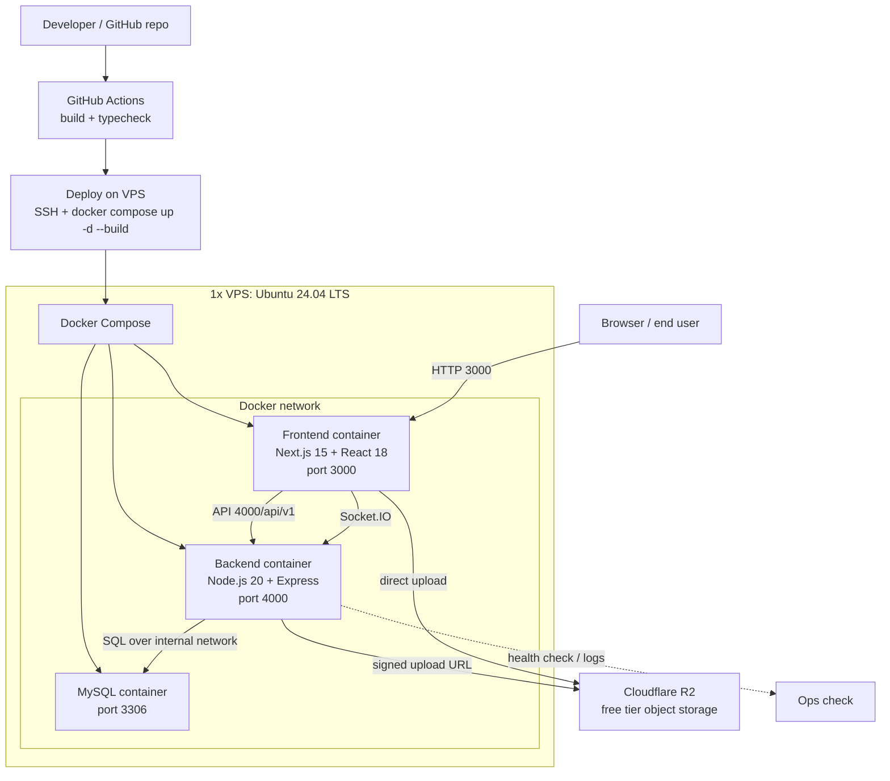

# Inicijalna struktura repozitorija i tehnički setup

Ovaj dokument razdvaja tri stvari: fizički skeleton projekta, branching strategiju i osnovni tehnički setup.

## 1. Šta je skeleton projekta

Skeleton projekta nije samo tekstualni opis, nego kompletan skup dijelova koji zajedno definišu kako će izgledati zaseban projektni folder kada se implementacija iz ovog dokumenta prenese u kod.

### 1.1 Kako skeleton izgleda

Skeleton je složen iz nekoliko jasno odvojenih cjelina:

- frontend sloj koji služi kao korisnički interfejs i koristi App Router pristup;
- backend sloj koji sadrži Express aplikaciju, Prisma ORM konfiguraciju, realtime bootstrap i domenske module;
- Prisma schema sloj koji definiše modele, relacije i buduće migracije za MySQL bazu;
- attachments sloj unutar backenda koji je početna tačka za file storage i kasniju object storage vezu;
- infrastrukturni sloj za MySQL inicijalizaciju i pokretanje servisa;
- zajednički projektni setup za skripte, build i lokalno podizanje cijelog stacka;

### 1.2 Uloga glavnih dijelova

- Frontend drži stranice, zajednički layout i klijente za API i socket komunikaciju.
- Backend drži bootstrap aplikacije, validaciju, poslovnu logiku i sve domenske rute.
- Attachments modul je mjesto gdje stoji početni file-storage stub za metapodatke i budući upload.
- Infrastruktura služi za MySQL init skripte i lokalni start servisa.
- Zajednički setup povezuje cijeli projekat u jednu radnu cjelinu.

## 2. Branching strategija: GitFlow

Za ovaj projekat je odabran GitFlow jer bolje štiti `master` branch, uvodi jasnu integracionu granu i razdvaja feature razvoj od release stabilizacije.

### 2.1 Glavni branchevi

`master` i `develop` su jedine dugotrajnije grane u projektu.

- `master` je stabilna grana i sadrži verzije spremne za deployment.
- `develop` je integraciona grana u koju se skupljaju gotove promjene prije release stabilizacije.

### 2.2 Pravila za odredjene tipove branch-a

- `feature/*` grana se kreira iz `develop` i završava merge-om nazad u `develop`.
- `fix/*` grana se kreira iz `develop` i završava merge-om nazad u `develop` nakon što bug bude potvrđen i zatvoren.
- `other/*` grana se kreira iz `develop` za ostale manje zadatke koji nisu feature, fix, release ili hotfix. (docs, chore...)
- `release/*` grana se kreira iz `develop` kada je skup funkcionalnosti spreman za provjeru; na toj grani se rade samo stabilizacija i sitne korekcije.
- `hotfix/*` grana se kreira iz `master` kada stabilna verzija ima problem koji ne može čekati sljedeći sprint.
- Nijedna radna grana ne ostaje dugo otvorena bez razloga; cilj je kratka, jasna i fokusirana promjena.

```text
Nova funkcionalnost
develop → feature/* → rad → PR → review → merge u develop → brisanje grane

Običan bugfix
develop → fix/* → ispravka → PR → review → merge u develop → brisanje grane

Održavanje i sitni tehnički zadaci
develop → other/* → izmjena → PR → review → merge u develop → brisanje grane

Priprema verzije
develop → release/x.x.x → stabilizacija → merge u master + develop → tag verzije → brisanje grane

Hitna produkcijska ispravka
master → hotfix/* → ispravka → PR → review → merge u master + develop → brisanje grane
```

### 2.3 PR i review

- Svaka promjena ide kroz pull request, bez direktnog push-a u `master`, jedino PR prema master grani radi Scrum Master kada je vrijeme za deployment novog release-a.
- PR treba da opiše šta je urađeno i na koju backlog stavku ili bug se odnosi.
- Ako se mijenja više slojeva odjednom, PR treba da bude dovoljno jasan da reviewer može pratiti tok promjene bez dodatnog kopanja.
- Code review radi najmanje jedan drugi član tima.
- Nakon odobrenja, PR se spaja i grana se briše da repozitorij ostane čist.

### 2.4 Konflikti

- Konflikti se rješavaju na radnoj grani, prije nego što promjena ode u target branch i to obavezno od strane autora grane.
- Manji konflikti se rješavaju odmah; veći konflikti se ne guraju na silu nego se prvo usaglasi dio logike koji se prelama.
- Kada konflikt zahvata više modula ili više ljudi radi isti dio, najbolje je da se developeri koji su autori koda sync-aju te zajedno riješe konflikte.

### 2.5 Commit konvencije

Commit poruke trebaju biti kratke, čitljive i dovoljno precizne da se iz historije vidi šta je tačno promijenjeno.

Koristi se ovaj obrazac:

```text
tip(opseg): kratak opis promjene

Primjeri:
fix(attachments): ogranicena dozvoljena velicina fajla
chore(ci): dodana compose komanda za full stack
test(health): dodan unit test za health endpoint
refactor(classdto xy): preimenovanje postojeceg atributa da odgovara klasi za koju je zadužen
```

U ovom projektu najčešće koristimo `feat`, `fix`, `docs`, `chore`, `test` i `refactor`.

- `feat` koristimo za novu funkcionalnost.
- `fix` koristimo za ispravku postojece logike.
- `docs` koristimo za promjene u dokumentaciji.
- `chore` koristimo za konfiguracijske promjene.
- `test` koristimo za testove i testne podatke.
- `refactor` koristimo kada mijenjamo strukturu bez promjene ponašanja.

Ako scope ne pomaže da se promjena lakše razumije, može se izostaviti.

### Zašto GitFlow

- Daje sigurniji `master` branch jer je odvojen od svakodnevnog feature razvoja.
- Omogućava da `develop` služi kao integracioni prostor prije release stabilizacije.
- Lako podržava sprint review, release candidate i hitne ispravke bez miješanja tokova.
- Bolje odgovara projektu koji ima i dokumentacionu i implementacionu fazu prije prvog stvarnog release-a.

## 3. Osnovni tehnički setup

### 3.1 Pregled stacka

Tehnički setup ovog projekta je složen oko jednog frontend sloja, jednog backend sloja, zajedničke baze podataka i jednog compose fajla koji sve to podiže zajedno. Ispod je pregled po slojevima i po alatima, da bude jasno šta se koristi i zašto.

| Sloj | Tehnologija / alat | Zašto je tu |
| --- | --- | --- |
| Frontend | Next.js 15, React 18, TypeScript | daje aplikacijski shell, route-based prikaz i tipiziran UI sloj |
| Backend | Node.js 20, Express, TypeScript, Prisma ORM | pokreće API, poslovnu logiku i server stranu aplikacije |
| Baza podataka | MySQL 8 | čuva trajne podatke sistema |
| File storage stub | attachments modul | rezervisano mjesto za metapodatke i kasniji upload |
| Kontejnerizacija | Docker Compose | podiže cijeli stack jednim procesom |
| Development tooling | npm workspaces, tsx, tsc | dijeli skripte, ubrzava razvoj i čini typecheck eksplicitnim |

| Biblioteka / alat | Gdje se koristi | Zašto je tu |
| --- | --- | --- |
| Axios | frontend | centralno HTTP povezivanje s API-jem |
| Socket.IO | frontend i backend | realtime komunikacija i događaji |
| Prisma Client | backend | tipiziran ORM sloj za rad s MySQL bazom |
| Prisma CLI | backend | generisanje clienta, migracije i schema workflow |
| Zod | backend | validacija ulaza na jednom mjestu |
| Helmet | backend | osnovni sigurnosni HTTP headeri |
| CORS | backend | kontrola pristupa između različitih origin adresa |
| dotenv | backend i development setup | učitavanje environment vrijednosti iz fajla |
| npm workspaces | root setup | organizacija frontend i backend paketa u jednom repozitoriju |
| tsx | backend dev server | brzo pokretanje TypeScript servisa bez ručnog builda |
| tsc | typecheck i build | provjera tipova i kompajliranje prije spajanja promjena |
| Docker Compose | lokalno pokretanje stacka | sve servise podiže iz jednog mjesta |

### 3.2 Frontend — Next.js

Frontend je organizovan kao App Router aplikacija i čini korisnički sloj sistema.

| Dio frontenda | Šta radi | Zašto postoji |
| --- | --- | --- |
| `src/app/layout.tsx` | zajednički layout i shell aplikacije | da sve stranice dijele isti okvir i istu navigaciju |
| route-based stranice | pojedinačne funkcionalnosti i prikazi | da svaka cjelina ima svoju rutu i svoj ekran |
| `src/lib/api.ts` | centralni HTTP klijent | da svi API pozivi prolaze kroz jedno mjesto |
| `src/lib/socket.ts` | centralni realtime klijent | da socket veza bude jedinstvena i kontrolisana |
| `src/styles/global.css` | globalni stilovi | da cijela aplikacija ima zajedničku vizuelnu osnovu |
| `src/types/global.d.ts` | globalne TypeScript definicije | da se tipovi mogu dijeliti kroz frontend bez dupliranja |
| environment vrijednosti | API i socket adrese | da frontend može raditi u više okruženja bez izmjene koda |

### 3.3 Backend — Node.js + Express

Backend je organizovan kao modularni API i obuhvata sve dijelove potrebne za pokretanje servisa, obradu zahtjeva i kasniji razvoj poslovne logike.

| Dio backenda | Šta radi | Zašto postoji |
| --- | --- | --- |
| `src/server.ts` | runtime bootstrap | pokreće server i veže ga za port |
| `src/app.ts` | centralna Express konfiguracija | drži middleware, rute i opšta podešavanja |
| `src/config/env.ts` | environment konfiguracija | učitava i provjerava varijable okruženja |
| `src/config/database.ts` | Prisma client singleton | centralizuje pristup MySQL bazi kroz ORM sloj |
| `src/routes/health.route.ts` | health provjera | daje brzu provjeru da servis radi |
| `src/realtime/socket.ts` | Socket.IO bootstrap | priprema realtime događaje i konekcije |
| `src/modules/*` | domenski moduli | razdvaja poslovne cjeline po funkciji |
| `src/modules/attachments/` | file-storage stub | početna tačka za metapodatke i budući upload |
| `backend/prisma/schema.prisma` | Prisma schema | definiše modele, relacije i putanju ka migracijama |

### 3.4 Baza podataka — MySQL

Koristi se MySQL 8, a backend pristupa bazi kroz Prisma Client i standardni `DATABASE_URL` connection string. MySQL container i dalje koristi `MYSQL_*` varijable za inicijalizaciju.

| Stavka | Vrijednost | Zašto |
| --- | --- | --- |
| Baza podataka | MySQL 8 | stabilno relacijsko čuvanje podataka |
| Konfiguracija backenda | `DATABASE_URL` | jedan standardni connection string za Prisma Client |
| Konfiguracija MySQL kontejnera | `MYSQL_*` varijable | da se kredencijali i parametri ne pišu direktno u kod |
| Inicijalni SQL | infrastrukturni sloj projekta | da seed i setup budu odvojeni od aplikacijske logike |

### 3.4.1 Prisma workflow

Prisma se koristi kao ORM sloj između Express backenda i MySQL baze. Zbog toga se schema i client generišu kroz standardne Prisma komande.

| Komanda | Kada se koristi | Zašto |
| --- | --- | --- |
| `npm run prisma:generate --workspace backend` | nakon instalacije i nakon svake promjene schema.prisma | generiše tipizirani Prisma Client |
| `npm run prisma:migrate --workspace backend` | kada se schema mijenja i treba formalna migracija | kreira migracije i ažurira bazu kroz kontrolisan proces |
| `npm run prisma:push --workspace backend` | u ranoj fazi ili kod brzog prototipiranja | sinhronizuje schema i bazu bez ručnog pisanja migracija |
| `npm run prisma:studio --workspace backend` | kada treba vizuelni pregled podataka | otvara Prisma Studio za pregled i uređivanje podataka |

### 3.5 Docker Compose i lokalni start

Cijeli stack se podiže iz jednog compose fajla i obuhvata frontend, backend i MySQL.

| Stavka | Vrijednost | Zašto |
| --- | --- | --- |
| Servisi u stacku | frontend, backend, MySQL | sve se podiže zajedno iz jednog mjesta |
| Start komanda | `npm run compose:up` | jedinstven ulaz za lokalni rad |
| Stop komanda | `npm run compose:down` | uredno gašenje stacka |
| Lokalni portovi | `3000`, `4000`, `3306` | predvidiv raspored servisa u razvoju |

### 3.6 Konfiguracione varijable

Jedan zajednički `.env` fajl nosi `PUBLIC_HOST`, `JWT_SECRET`, `DATABASE_URL` i `MYSQL_*` varijable.

| Varijabla | Gdje se koristi | Zašto |
| --- | --- | --- |
| `PUBLIC_HOST` | frontend, backend i deploy setup | javna adresa aplikacije |
| `JWT_SECRET` | backend auth sloj | potpisivanje i provjera tokena |
| `DATABASE_URL` | backend Prisma Client | konekcija prema MySQL bazi kroz ORM sloj |
| `MYSQL_*` | backend i baza | kredencijali i parametri za vezu prema bazi |

`PUBLIC_HOST` mora biti browser-accessible host, najčešće `http://localhost` za lokalni rad ili javni host/IP za server.

### 3.7 File storage

File storage je predviđen kroz attachments modul u backendu.

| Element | Odabir | Zašto |
| --- | --- | --- |
| `attachments` modul | početni file-storage stub | da postoji jasno mjesto za upload logiku i metapodatke |
| Cloud storage | Cloudflare R2 free tier | da se binarni fajlovi drže van aplikacijskog servera i da storage ostane besplatan u okviru projekta |
| Upload način | backend izdaje upload URL, frontend šalje fajl direktno u storage | da backend ne prenosi teške fajlove kroz vlastiti proces |
| Metapodaci u bazi | MySQL | da fajlovi ostanu pretraživi i povezani s aplikacijskim entitetima |
| Pristup bucketu | privatni bucket sa kontrolisanim pristupom | da fajlovi ne budu javni po defaultu |

### 3.8 CI/CD i deploy

GitHub Actions je planiran za build i typecheck prije merge-a.

| Stavka | Vrijednost | Zašto |
| --- | --- | --- |
| CI alat | GitHub Actions | da se provjere build i typecheck prije merge-a |
| Deploy grana | `master` | produkcija ide samo iz stabilne grane |
| Deploy target | isti stack kao lokalni, ali s javnim hostom | da se razvojni i produkcijski model ne razlikuju previše |

### 3.9 Produkcijska infrastruktura i serveri

Za ovaj projekat je optimalno da produkcija krene na jednom Linux VPS-u, a ne na više fizičkih ili virtuelnih mašina. Time se smanjuju trošak, operativna složenost i vrijeme održavanja, a i dalje ostaje dovoljno jasno razdvajanje kroz Docker kontejnere.

| Stavka | Naš odabir | Zašto |
| --- | --- | --- |
| Tip servera | jedna virtuelna mašina / VPS | najjednostavniji i najisplativiji start za projekat ovog obima |
| Operativni sistem | Ubuntu 24.04 LTS | stabilan Linux, dobra podrška za Docker i dugoročno održavanje |
| Resursi VPS-a | minimalno 2 vCPU i 4 GB RAM | dovoljno za frontend, backend i MySQL bez nepotrebnog stezanja resursa |
| Broj VM-ova | 1 | dovoljno za MVP i lakše administriranje |
| Broj Docker kontejnera u produkciji | 3 osnovna kontejnera | frontend, backend i baza pokrivaju cijeli sistem |
| Database server | isti VPS kao backend, ali odvojen u svom Docker kontejneru | separation of concerns se postiže kroz kontejnere, a ne kroz zaseban server |
| Poseban DB server | nije potreban u prvoj fazi | uvodi se tek ako poraste opterećenje ili sigurnosni zahtjevi |

U ovoj postavci frontend i backend su na istoj VPS mašini, baza je također na istoj mašini, ali u zasebnom kontejneru, a file storage je izvan servera kroz Cloudflare R2 free tier. To je najbolji odnos između jednostavnosti, troška i održavanja za projekat ovog tipa.

### 3.10 Kako izgleda deploy

Deploy se radi na istu tu VPS mašinu, preko Dockera i jednog compose fajla. GitHub Actions služi za provjeru koda prije release-a, a nakon toga se na serveru podiže nova verzija stacka.

| Korak | Opis | Zašto |
| --- | --- | --- |
| 1 | CI provjera u GitHub Actions | da se build i typecheck uhvate prije produkcije |
| 2 | server povuče novu verziju repozitorija i uradi `docker compose up -d --build` | da produkcija uvijek koristi svežu verziju koda |
| 3 | Compose zamijeni stare kontejnere novim verzijama | da se nova verzija aktivira bez ručnog pokretanja servisa |
| 4 | provjera health endpointa i osnovnih ruta | da se odmah vidi da je deploy prošao ispravno |

Za naš projekat je dovoljno da se deploy radi na jednoj VPS mašini sa Dockerom, bez dodatne fizičke infrastrukture.

### 3.11 Dijagram deploy topologije



## 4. Šta je trenutno otvoreno za dalji razvoj

| Otvoreno pitanje | Trenutno stanje | Šta još treba uraditi |
| --- | --- | --- |
| CI/CD workflow | nije implementiran | definisati i povezati build i typecheck korake |
| Migracije i seed | nisu formalizovane | opisati i standardizovati početne skripte za bazu |
| Auth model | još nije zaključen | precizirati konačni tok autentikacije i autorizacije |
| Cloud storage detalji | nisu implementirani | definisati bucket politiku i testno okruženje za free-tier storage |
| Dokumentacija scaffolda | prati trenutno stanje | dopunjavati kako se otvaraju ili zatvaraju tehnički detalji |
